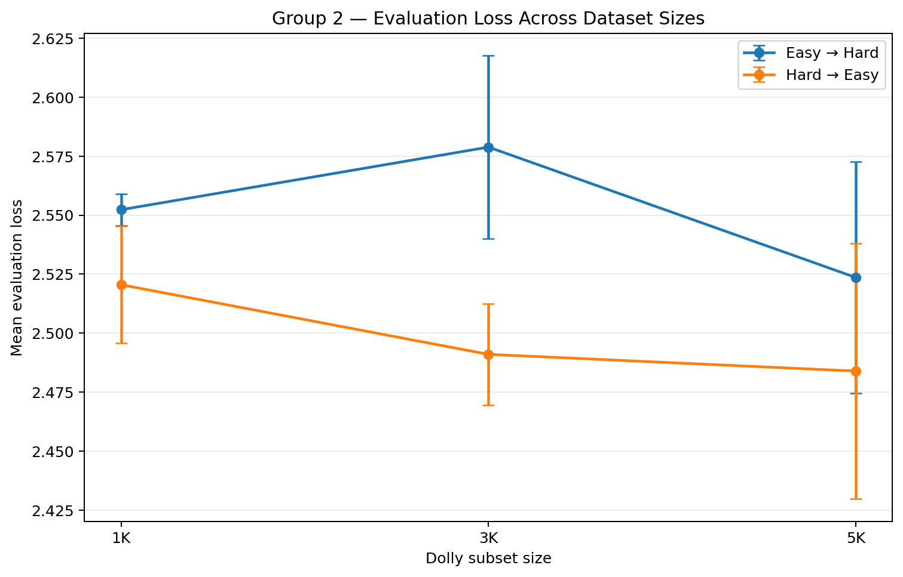

# Controlled Mini-Batch Ordering for Instruction Fine-Tuning

An empirical research repository studying how **mini-batch composition** and
**training-example order** affect instruction fine-tuning under a matched
multi-seed protocol.

## Completed Experiments

### Group 1 — Semantic / Random Batching

- Random
- Semantically Grouped
- Grouped → Random
- Random → Grouped

Semantic retrieval: `all-MiniLM-L6-v2` + FAISS, instruction+context embeddings,
`top_k=8`.

```text
3 dataset sizes × 4 strategies × 3 seeds = 36 runs
```

### Group 2 — Length Curriculum

- Easy → Hard
- Hard → Easy

Difficulty proxy: **full tokenized instruction+context length before
training-time truncation**.

```text
3 dataset sizes × 2 directions × 3 seeds = 18 runs
```

### Total

```text
54 reviewed runs
```

## Shared Setup

- Model: `google/flan-t5-small`
- Dataset: Dolly 15K subsets at 1K / 3K / 5K
- LoRA: r=8, alpha=16, dropout=.05, q/v targets
- Batch size: 3
- Gradient accumulation: 2
- Max optimizer steps: 300
- Learning rate: `3e-3`
- Seeds: 13, 21, 42
- Metrics: evaluation loss + ROUGE-1/2/L

BERTScore is not part of the verified pipeline.

## Results at a Glance

**Group 1:** no semantic/random batching strategy consistently dominates across
scales and metrics; differences are generally small relative to seed
variability, leaving random batching as a strong baseline.


**Group 2:** Hard → Easy has lower mean evaluation loss at all three scales.
ROUGE instead favors Easy → Hard at 1K/3K and Hard → Easy at 5K, so there is no
universal curriculum-direction winner.



No formal statistical-significance claim is made.

## Repository Structure

```text
configs/
├── group1/
└── group2/
docs/
notebooks/
├── 00_validation/
├── 01_group1/
└── 02_group2/
results/
├── group1/
└── group2/
scripts/
├── run_group1.py
└── run_group2.py
src/
tests/
```

## Result Artifacts

- Group 1: [`results/group1/`](results/group1/)
- Group 2: [`results/group2/`](results/group2/)
- Protocol: [`docs/experiment-protocol.md`](docs/experiment-protocol.md)
- Methodology: [`docs/methodology.md`](docs/methodology.md)

## Reproducibility Principle

```text
completed protocol → preserve for reproducibility
methodology change → document separately and rerun
```

The completed experiments retain padded target token IDs in the label sequence
instead of converting padding to `-100`; the curated code preserves the
executed behavior.

## Notebook Provenance

Group 1 notebooks are retained as experiment artifacts. Group 2 notebooks in
the public repo are curated source-only copies; verified metrics are published
separately in `results/group2/`.

## Artifact Policy

Checkpoints, raw datasets, caches, embeddings, FAISS index files, raw prediction
dumps, and transient training outputs are intentionally excluded.

## Versioning

Earlier thesis experiments used materially different settings and remain
isolated as legacy research rather than being mixed into the matched 54-run
result set.

## Author

**Aroosh Ahmad** — MPhil Artificial Intelligence

Research interests: Large Language Models, NLP, instruction fine-tuning,
retrieval, evaluation, and applied AI systems.
