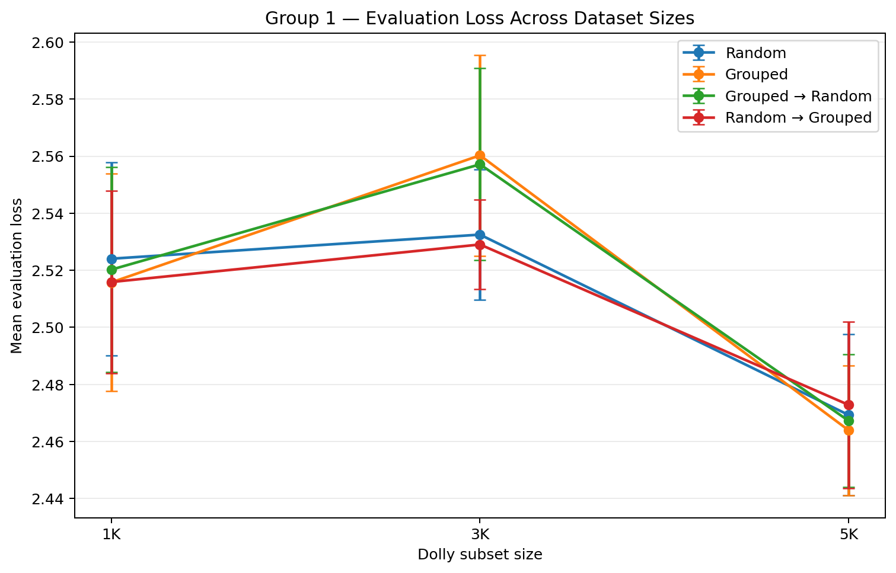
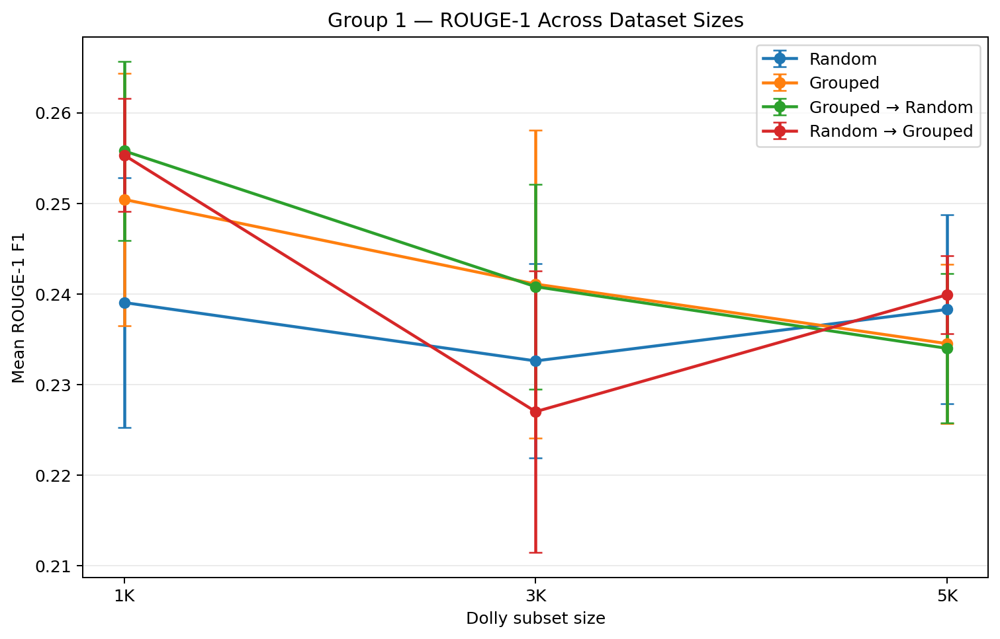
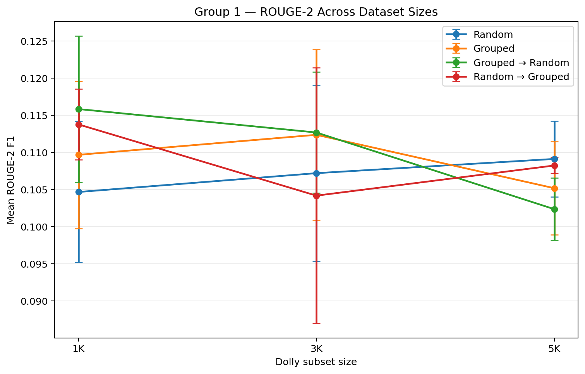
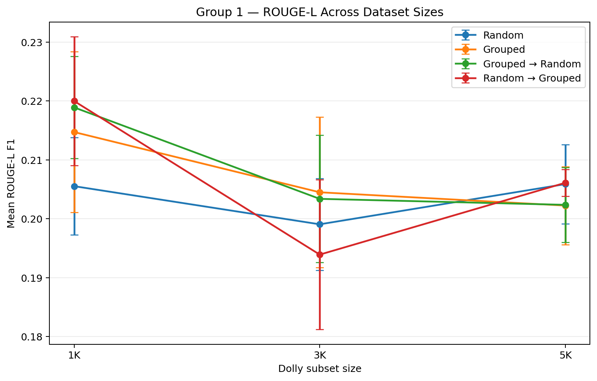

# Group 1 Results

This directory contains reviewed metrics consolidated from the executed Dolly
1K, 3K, and 5K multi-seed notebooks.

No training run was repeated to create these repository artifacts.

## Experiment Matrix

```text
3 dataset sizes
× 4 batching strategies
× 3 random seeds
= 36 runs
```

Dataset sizes:

- Dolly 1K
- Dolly 3K
- Dolly 5K

Strategies:

- `random`
- `grouped`
- `grouped_to_random`
- `random_to_grouped`

Seeds:

- `13`
- `21`
- `42`

## Result Files

### `per_seed_results.csv`

Contains one row for every completed Group 1 run with:

- dataset size
- batching strategy
- seed
- evaluation loss
- ROUGE-1 F1
- ROUGE-2 F1
- ROUGE-L F1

### `summary.csv`

Contains 12 aggregate rows:

```text
3 dataset sizes × 4 strategies = 12 summaries
```

Each metric reports the arithmetic mean and sample standard deviation across
the three seeds.

## Figures

### Evaluation Loss



### ROUGE-1



### ROUGE-2



### ROUGE-L



Error bars represent one sample standard deviation across the three experiment
seeds.

## Descriptive Finding

No single batching strategy is the best across all dataset sizes and all
metrics.

The best aggregate mean changes by metric and dataset size:

- the 1K condition shows modest generation-metric advantages for curriculum
  variants;
- the 3K condition has mixed winners across loss and ROUGE metrics;
- the 5K condition again produces mixed winners, with random or structured
  strategies depending on the metric.

The differences are generally small and should be interpreted alongside the
seed-to-seed standard deviations.

No formal statistical-significance claim is made here.

## Evaluation Scope

The verified Group 1 metrics are:

- evaluation loss
- ROUGE-1 F1
- ROUGE-2 F1
- ROUGE-L F1

BERTScore is intentionally excluded because it was not calculated by the
verified Group 1 evaluation implementation.

## Protocol

The canonical machine-readable configurations are:

```text
configs/group1/dolly_1k.yaml
configs/group1/dolly_3k.yaml
configs/group1/dolly_5k.yaml
```

The human-readable protocol is documented in:

```text
docs/experiment-protocol.md
```

The contrastive-learning extension is a separate experiment and must not
overwrite these baseline artifacts.
